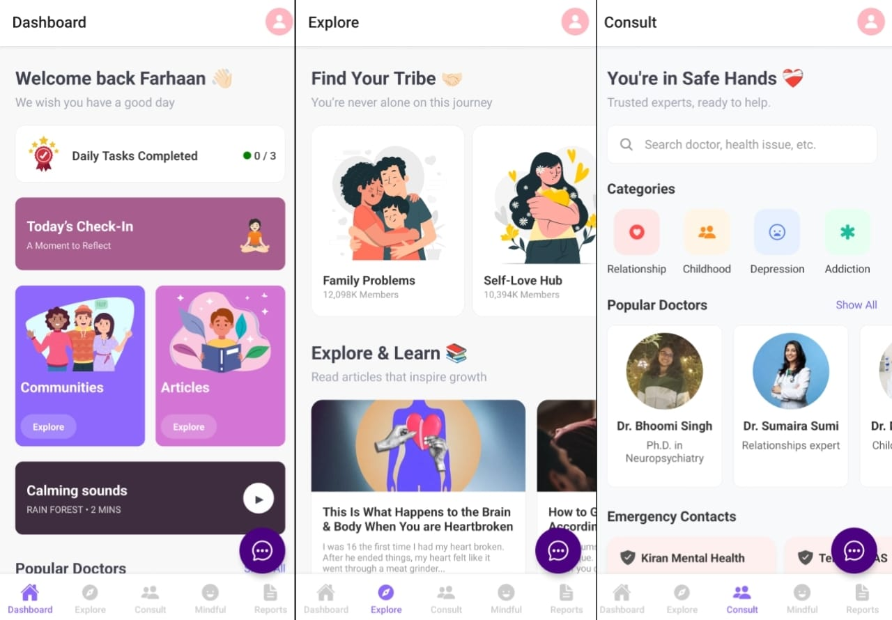
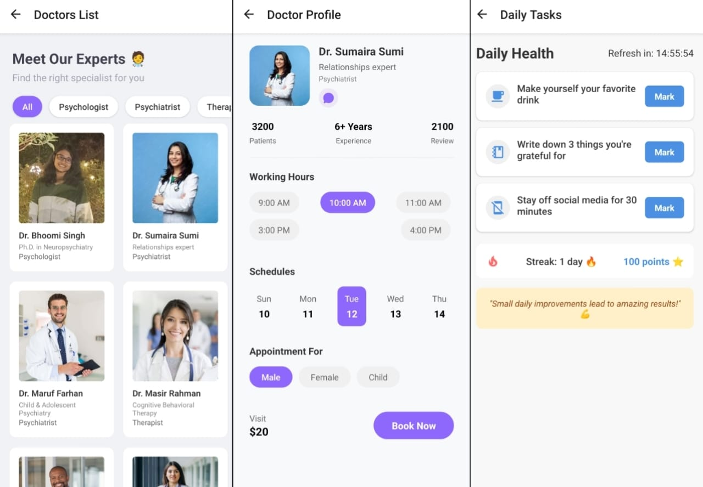
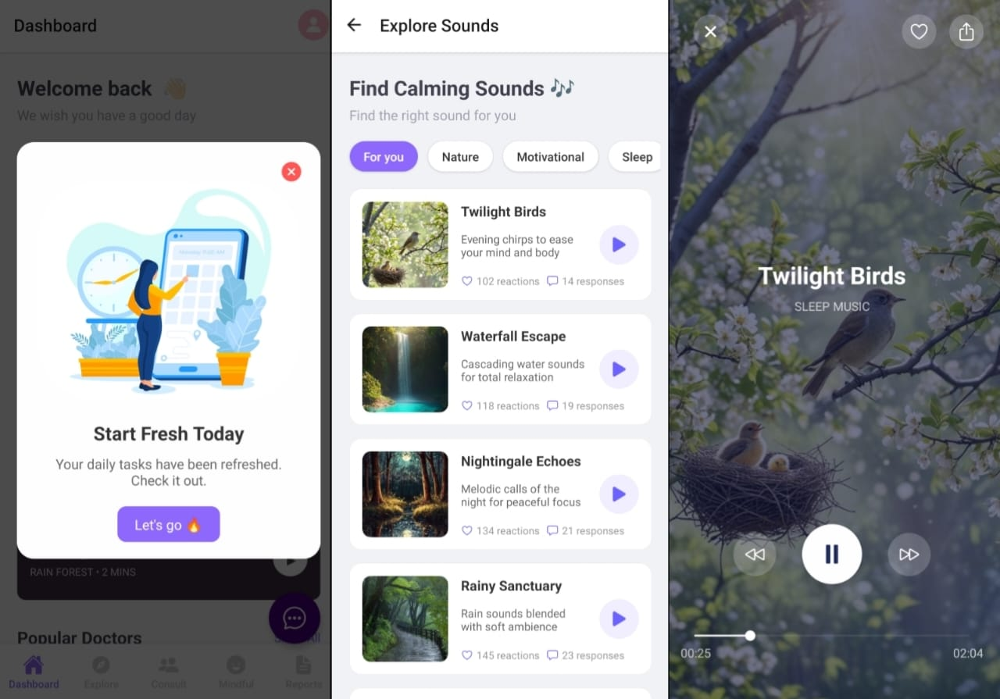
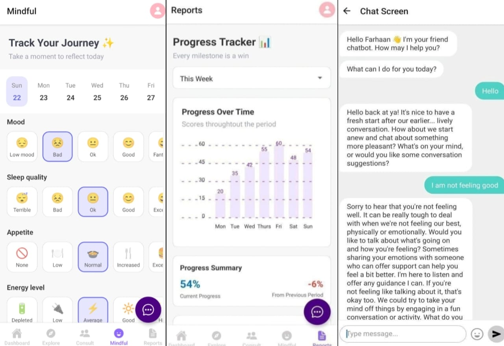

# 🧠 Wellbeing

---

## 📖 Description

Wellbeing is a **mobile-first mental health support app built with Expo (React Native)** that helps users improve their emotional well-being through simple, guided interactions and daily actions.

The app focuses on reducing overwhelm by avoiding complex onboarding and instead offering **direct support through conversation, reflection, and small actionable steps**.

The goal is to make mental health support feel
👉 **simple, accessible, and consistent in everyday life**

---

## ✨ Features

* 🤖 **AI Companion (Chat-Based Support)**
  A conversational AI that interacts like a supportive friend, helping users reflect and navigate thoughts.

* ✅ **Daily Action Tasks**
  Small, practical tasks designed to improve mood, habits, and mental clarity.

* 📊 **Progress Awareness**
  Tracks user engagement and activity to provide a sense of growth over time.

* 🔔 **Smart Reminders (Planned/Integrated)**
  Gentle nudges to maintain consistency without being overwhelming.

* 👥 **Community & Expert Support (Planned)**
  Option to connect with others or seek expert help when needed.

* 🔒 **Privacy-Focused Design**
  User data is handled with strong privacy considerations.

* 📱 **Mobile-First Experience (Expo)**
  Built entirely for mobile using React Native (Expo).

---

## 🚀 Installation (Expo App)

### 1️⃣ Clone the repository

```bash id="p8h2sd"
git clone <your-repo-url>
cd wellbeing
```

---

### 2️⃣ Install dependencies

```bash id="q4m1xn"
npm install
```

---

### 3️⃣ Run the app (Expo)

```bash id="z7k9rt"
npx expo start
```

Then:

* Scan QR with Expo Go (Android/iOS)
* Or run on emulator

---

## 🛠️ Usage

1. Open the app
2. Start interacting with the **AI companion**
3. Follow suggested **tasks or actions**
4. Stay consistent with small daily improvements
5. Observe changes in mood and habits over time

---

## 🧩 Tech Stack

### 📱 Frontend

* **React Native (Expo)** → Mobile-first UI
* **React Navigation** → App navigation

### ⚙️ Backend

* **Flask / Node.js** → Handles AI requests and logic

### 🧠 AI Integration

* **Groq API (LLM)** → Powers conversational AI and guidance

### 📦 State Management

* Manages user activity, interactions, and progress

### 🔔 Notifications

* **Firebase (Planned/Integrated)** → Timely reminders and engagement

---

## 🧠 Core Philosophy

Wellbeing is built on three principles:

* **Minimal friction** → No overwhelming onboarding
* **Action-oriented** → Focus on doing, not just consuming
* **Consistency over intensity** → Small steps, repeated daily

---

## 🤝 Contributing

Contributions are welcome!

If you’d like to improve:

* User experience
* AI interactions
* Performance or scalability

Feel free to open an issue or submit a pull request.

---

## 📸 Screenshots





---

## 📬 Contact

📧 [farhaan8d@gmail.com](mailto:farhaan8d@gmail.com)
🔗 [https://www.linkedin.com/in/fsfarhaanshaikh](https://www.linkedin.com/in/fsfarhaanshaikh)

---
